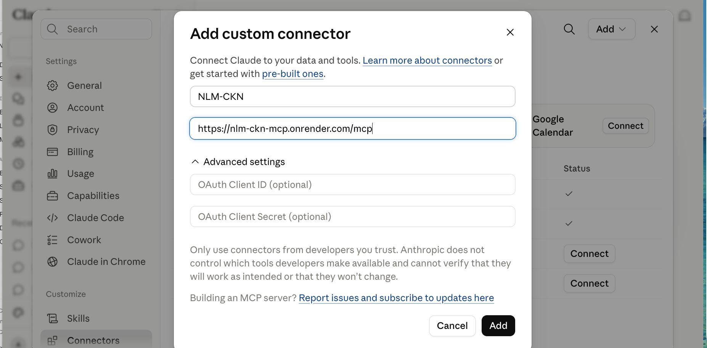
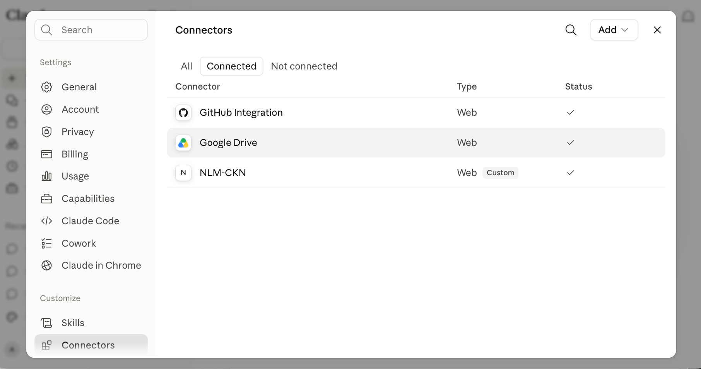

# NLM-CKN MCP Server

A small **MCP (Model Context Protocol) server** that gives Claude a safe, curated
set of tools for searching and exploring the **NLM Cell Knowledge Network
(NLM-CKN)** — the cell-type knowledge graph behind <https://nlm-ckn.org>.

You ask Claude a question in plain English ("What T cell subtypes are in the
graph, and what are they related to?") and Claude uses these tools to search the
knowledge graph and walk its connections for you.

- **Documentation site:** <https://nih-nlm.github.io/NLM-CKN-MCP/>
- **Hosted server (MCP endpoint):** `https://nlm-ckn-mcp.onrender.com/mcp`

---

## For NIH users — use it in your browser (no install)

This is the path for everyone who just wants to *use* the tools. **Nothing to
install, no Python, no Claude Desktop** — it works in the browser at
[claude.ai](https://claude.ai).

1. Go to **[claude.ai](https://claude.ai)** and sign in.
2. In the left sidebar, scroll down to below **Customize** and select
   **Connectors**, then **Add custom connector**.
3. Give it a name (I called it `NLM-CKN`) and paste this address:

   ```
   https://nlm-ckn-mcp.onrender.com/mcp
   ```

   **No OAuth Client ID or OAuth Client Secret is required** — leave those blank.
4. Press **Add**.

   

5. This connects you. In your **Connectors** list you'll see **N — NLM-CKN**
   with a **✓** checkmark (Type *Web*, *Custom*), confirming you're connected.

   

Then start a new chat and ask something like:

> Search Cell-KN for "T cell" and show me the top results.

> Take CL/0000084 and show me what it's connected to in the graph.

Any problems, feel free to reach out.

**Requirements / good to know:**

- Custom connectors require a **paid Claude plan** (Pro, Team, or Enterprise).
- On a **Team/Enterprise** organization, an **admin may need to enable custom
  connectors** before the option appears. If you don't see *Add custom
  connector*, ask your Claude workspace admin.
- If the very first connection attempt fails with a sign-in / registration
  error, just press **Connect** again — the server may have been waking up, and
  a second try after it's warm goes through.

---

## Why go through this server?

The NLM-CKN knowledge graph lives in an ArangoDB database. In principle a
database can be queried directly, but that is **not** the path we want NIH users
on, for several reasons:

- **Safety.** This server exposes only a **small, read-only, purpose-built** set
  of tools — search and graph traversal. There is no way through it to run
  arbitrary, expensive, or destructive database queries.
- **No expertise required.** Users don't need to learn the query language or the
  graph schema. They ask in English; Claude picks the right tool and fills in the
  arguments.
- **Stability.** The database layer is still being hardened (the team is moving
  to a properly separated **public, read-only** interface). Because users go
  through these fixed MCP tools, that backend work can happen **without changing
  anything for users** — the tools keep working the same way.

## Two ways to run this server

The **same code** works two completely separate ways, chosen at startup. They do
not interfere — a Desktop user and a web user can both use it at once.

| | **A. Local (Claude Desktop / Claude Code)** | **B. Web (claude.ai in a browser)** |
|---|---|---|
| Who installs what | Each user installs Python + this repo | **Nothing** — just paste a URL |
| Where the server runs | On the user's own laptop | On a host you set up once (Render, AWS, …) |
| Transport | stdio (the default) | Streamable HTTP (`MCP_TRANSPORT=http`) |
| Best for | Developers, a single machine | Non-technical users, many people |

Section **A** is the Claude Desktop config shown above (nothing about it changes).
Sections **B** below cover the web option.

## Web hosting on Render (for the maintainer)

The web option needs the server running somewhere with a public HTTPS address.
The repo ships a `render.yaml` blueprint so [Render](https://render.com) can host
it in a few clicks. (Any host works — Render is just the simplest starting point.
The identical code can later move to an NIH STRIDES / AWS instance by running it
with `MCP_TRANSPORT=http`.)

**Cost:** Render's **Free** plan is `$0`, but the server *sleeps* after ~15 min
idle (the first request afterward takes 30–60s to wake). For always-on, change
`plan: free` to `plan: starter` (~$7/month) in `render.yaml`. Nothing else changes.

**One-time deploy steps:**

1. Make sure the repo is pushed to GitHub (Render deploys *from* GitHub):
   ```bash
   git add render.yaml pyproject.toml src/cell_kg_mcp/server.py
   git commit -m "Add web (Streamable HTTP) mode + Render blueprint"
   git push
   ```
2. Go to **render.com** → **Get Started** → **Sign in with GitHub** (authorize
   access to the `NIH-NLM` repositories).
3. Click **New +** (top-right) → **Blueprint**.
4. Choose the **`NLM-CKN-MCP`** repository → **Connect**.
5. Render reads `render.yaml` and shows a service named **`nlm-ckn-mcp`** on the
   **Free** plan → click **Apply** (or **Create**).
6. Wait ~2–3 minutes for the first build. The log ends with `Uvicorn running on …`.
7. At the top of the service page you'll see its address, e.g.
   `https://nlm-ckn-mcp.onrender.com`.
8. **The MCP address is that URL with `/mcp` on the end:**
   ```
   https://nlm-ckn-mcp.onrender.com/mcp
   ```
   Give that `/mcp` URL to your users (next section).

**Check it's live** (optional, from any terminal):

```bash
curl -sS -X POST https://nlm-ckn-mcp.onrender.com/mcp \
  -H "Content-Type: application/json" \
  -H "Accept: application/json, text/event-stream" \
  -d '{"jsonrpc":"2.0","id":1,"method":"initialize","params":{"protocolVersion":"2025-06-18","capabilities":{},"clientInfo":{"name":"probe","version":"0.0"}}}'
```

A response containing `"serverInfo":{"name":"cell-kg-search"…}` means it works.
(On the free plan the very first call after idle may take ~30–60s.)

## Adding the connector in claude.ai (for NIH users — no install)

Once the server is hosted and you have its `/mcp` URL, anyone can use it from
**claude.ai in a browser** — no Python, no config files, no Claude Desktop.

1. Open **[claude.ai](https://claude.ai)** and sign in.
2. Click your initials (bottom-left) → **Settings**.
3. Go to **Connectors** → **Add custom connector**.
4. Give it a name (e.g. `NLM-CKN`) and paste the URL your maintainer gave you:
   ```
   https://nlm-ckn-mcp.onrender.com/mcp
   ```
   → **Add**.
5. Start a new chat and ask, for example:
   > Search Cell-KN for "T cell" and show me the top results.

   The first time, Claude asks permission to use the connector — allow it.

**Requirements / gotchas:**

- Custom connectors require a **paid Claude plan** (Pro, Team, or Enterprise).
- On a **Team/Enterprise** organization, an **admin may need to enable custom
  connectors** before the option appears. If you don't see *Add custom connector*,
  ask your Claude workspace admin.
- On the **free Render tier**, the first request after the server has been idle
  takes ~30–60s while it wakes up; later requests are fast. Upgrade to
  `plan: starter` to remove this.

## What is happening?

---

## What the server provides

Five tools, all read-only:

| Tool | What it does |
|---|---|
| `search_cell_kn` | Search Cell-KN (`phenotypes` or `ontologies`) and return compact results. |
| `get_cell_kn_search_defaults` | Report the default search fields used for each database. |
| `list_cell_kn_collections` | List the graph collections / ontology prefixes (CL, GO, UBERON, …). |
| `get_cell_kn_neighbors` | Traverse the graph from one or more node `_id`s to related nodes and links. |
| `get_cell_kn_node` | Fetch a single node's full record by `_id`. |

Full, always-current API documentation is generated from the code and published
at **<https://nih-nlm.github.io/NLM-CKN-MCP/>**.

---

## For the maintainer — hosting the server

The browser path above only works because the server is **running somewhere with
a public HTTPS address**. A web browser cannot launch a local program, so the
server must be hosted. This repo is set up to make that a few clicks.

### The same code runs two ways

| Mode | How it starts | Used for |
|---|---|---|
| **stdio** (default) | `python -m cell_kg_mcp` | Local use in Claude Desktop / Claude Code |
| **HTTP** (web) | same command, with `MCP_TRANSPORT=http` | Hosted server for claude.ai users |

The switch is the single environment variable `MCP_TRANSPORT`. Nothing else
differs, and the two modes never interfere.

### Hosting on Render (current)

1. Push the repo to GitHub (Render deploys *from* GitHub).
2. On **render.com** → **New +** → **Web Service** → connect the `NLM-CKN-MCP`
   repo.
3. Set these fields:

   | Field | Value |
   |---|---|
   | **Build Command** | `pip install -e .` |
   | **Start Command** | `python -m cell_kg_mcp` |
   | **Instance Type** | Starter (always-on) or Free (sleeps when idle) |

4. Add **Environment Variables**:

   | Key | Value | Required? |
   |---|---|---|
   | `MCP_TRANSPORT` | `http` | **Yes** — without it the server starts in stdio mode and exits immediately. |
   | `MCP_ALLOWED_HOSTS` | `nlm-ckn-mcp.onrender.com` | Optional — re-enables Host-header protection scoped to your domain. |

5. Click **Deploy Web Service**. A healthy boot ends with `Uvicorn running on
   http://0.0.0.0:…` in the log. The MCP address is your service URL **+ `/mcp`**.

**Verify it's live** from any terminal:

```bash
curl -sS -X POST https://nlm-ckn-mcp.onrender.com/mcp \
  -H "Content-Type: application/json" \
  -H "Accept: application/json, text/event-stream" \
  -d '{"jsonrpc":"2.0","id":1,"method":"initialize","params":{"protocolVersion":"2025-06-18","capabilities":{},"clientInfo":{"name":"probe","version":"0.0"}}}'
```

A response containing `"serverInfo":{"name":"cell-kg-search"…}` means it works.

### Moving to AWS / STRIDES later

Render is an interim host. The identical code runs on any always-on host — an NIH
STRIDES / AWS instance included. To move it: run the server there with
`MCP_TRANSPORT=http`, set `MCP_ALLOWED_HOSTS` to the new domain, point users at
the new `/mcp` URL, and retire the Render service. No code changes.

---

## For developers — run it locally (Claude Desktop / Claude Code)

If you're developing, or prefer the tools on your own machine, run the server in
its default **stdio** mode and let Claude Desktop launch it.

**Install into a conda env:**

```bash
git clone https://github.com/NIH-NLM/NLM-CKN-MCP.git
cd NLM-CKN-MCP
conda env create -f environment.yml
conda activate nlm-ckn-mcp
pip install -e .
```

**Tell Claude Desktop about it.** On a Mac the config file is at
`~/Library/Application Support/Claude/claude_desktop_config.json`. Add:

```json
{
  "mcpServers": {
    "NLM-CKN": {
      "command": "/Users/**[username]**/miniforge3/envs/nlm-ckn-mcp/bin/python",
      "args": ["-m", "cell_kg_mcp"]
    }
  }
}
```

Replace `**[username]**` with your username, and use the **absolute path** to the
Python inside your conda env — Claude Desktop does not inherit your shell's PATH.
Find that path with:

```bash
conda activate nlm-ckn-mcp && python -c "import sys; print(sys.executable)"
```

Then restart Claude Desktop. It launches the server, sees the tools, and you're
done.

---

## How it works

This code was supplied by Senior Solutions Engineer **Sangram Sahu** and follows
a common, sensible pattern: **separate "what to expose to Claude" from "how to
actually talk to the backend."**

- **`client.py` — the kitchen.** Plain Python that knows the backend address and
  how to call it: it builds the request, sends the HTTP call, checks for errors,
  and returns results. It knows nothing about MCP or Claude, and could be reused
  in any script.
- **`server.py` — the menu.** The MCP server. `mcp = FastMCP("cell-kg-search")`
  creates it, and each `@mcp.tool()`-decorated function becomes a tool Claude can
  see and call. The docstring is what Claude reads to decide *when* to use a
  tool; the function arguments become the inputs Claude fills in. `main()` starts
  the server — in stdio mode for Desktop, or HTTP mode for web hosting.

Rule of thumb: **`server.py` is the menu Claude sees; `client.py` is the kitchen
that cooks.**

---

## Documentation

API docs are generated from the code's docstrings with **Sphinx** (autodoc),
following the same model as
[`oadr-cpep`](https://github.com/NIH-NLM/oadr-cpep), and published to **GitHub
Pages** by `.github/workflows/docs.yml` on every push to `main`.

- Published site: <https://nih-nlm.github.io/NLM-CKN-MCP/>

**One-time setup (repo admin):** in the GitHub repo, **Settings → Pages** → set
**Source: GitHub Actions**. After that, docs rebuild and redeploy on their own.

**Build the docs locally:**

```bash
pip install -e .
pip install sphinx myst-parser sphinx-rtd-theme
sphinx-apidoc -f --separate -o docs/source/ src/cell_kg_mcp
cd docs && make html
# open docs/build/html/index.html
```

---

## Troubleshooting

- **`Invalid Host header` (HTTP 421)** when hosting.
  - Cause: the MCP HTTP server's DNS-rebinding protection trusts only
    `localhost` and rejects the hosting domain.
  - Fix: this is handled automatically in HTTP mode. To re-enable protection
    scoped to your domain, set `MCP_ALLOWED_HOSTS` to your host (e.g.
    `nlm-ckn-mcp.onrender.com`).
- **`Application exited early`** on a host right after "Build successful."
  - Cause: `MCP_TRANSPORT=http` is not set, so the server ran in stdio mode and
    exited with no terminal attached.
  - Fix: add the `MCP_TRANSPORT=http` environment variable and redeploy.
- **`Failed to spawn process: No such file or directory`** (Claude Desktop).
  - Cause: the client can't find the Python on PATH.
  - Fix: use the **absolute** Python path in `claude_desktop_config.json`.

---

## Documentation

API documentation is generated automatically from the code's docstrings with
**Sphinx** (autodoc), following the same model as
[`oadr-cpep`](https://github.com/NIH-NLM/oadr-cpep). On every push to `main`, the
`.github/workflows/docs.yml` workflow builds the HTML and publishes it to
**GitHub Pages**:

- Published site: <https://nih-nlm.github.io/NLM-CKN-MCP/>

One-time setup (repo admin): in the GitHub repo, go to **Settings → Pages** and
set **Source: GitHub Actions**. After that, docs rebuild and redeploy on their own.

Build the docs locally:

```bash
pip install -e .
pip install sphinx myst-parser sphinx-rtd-theme
sphinx-apidoc -f --separate -o docs/source/ src/cell_kg_mcp
cd docs && make html
# open docs/build/html/index.html
```

## Run tests

```bash
pytest
```
